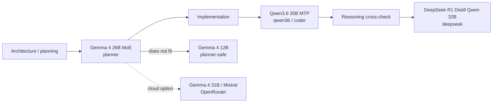

# ⚡ Local AI Coding Stack

<p align="center">
  
</p>

<p align="center">
  <strong>A local llama.cpp + Aider + Codex coding setup on a 12&nbsp;GB NVIDIA GPU, with OpenRouter as the cloud escape hatch.</strong><br>
  CachyOS · fish · llama.cpp CUDA · Aider · Codex · OpenRouter · OpenCode
</p>

**Version:** `0.3.0` (`20260706`)

This repo is the personal reference for my local AI coding stack. The
short version: a 12 GB VRAM CachyOS box runs `llama-server` against local
GGUF models, Aider talks to it through an OpenAI-compatible endpoint, and
OpenRouter is the cloud fallback when the local GPU is busy or I want a
different model. Codex handles the structured repo maintenance work.

> **Naming note:** the local folder is `~/ai/local-ai-stack` while the GitHub
> repo is `local-ai-coding-stack`. The discrepancy is historical and
> intentional.

Companion project: **[Gmail Sorter](https://github.com/Rad-ops/gmail-sorter)**.
The Gmail Sorter Trash-rescue review is the one real workload that proved
this stack useful beyond synthetic prompts: 6,531 bounded mailbox reviews
run end-to-end through the local Qwen3.6 profile.

> **Need to continue this project in a new chat?** Upload or paste
> [`docs/10-CONTINUATION-HANDOFF.md`](docs/10-CONTINUATION-HANDOFF.md). It is
> the single canonical handoff file and contains everything a fresh session
> needs.

---

## 🧭 Stack at a glance

| Layer | Choice | Role |
| --- | --- | --- |
| 🏗️ Planner | Gemma 4 26B A4B MoE (`planner`), with Gemma 4 12B (`planner-safe`) as fallback | Architecture, decomposition, risks, test strategy |
| 🛠️ Implementer | Qwen3.6-35B-A3B-MTP (`coder` / `qwen36`) | Daily coding and repo work |
| 🧠 Reasoning fallback | DeepSeek-R1-Distill-Qwen-32B (`deepseek`) | Hard debugging and reasoning checks |
| ☁️ Cloud escape hatch | Gemma 4 31B (default) through OpenRouter | When the local GPU is busy or I want a different model |



---

## 🖥️ Hardware & paths

- **OS:** CachyOS Linux
- **Shell:** fish
- **GPU:** RTX 4070 Super-class NVIDIA GPU
- **VRAM:** 12 GB
- **RAM:** ~32 GB
- **Local endpoint:** `http://127.0.0.1:8080/v1`
- **llama.cpp source:** `~/ai/llama.cpp`
- **llama.cpp server:** `~/ai/llama.cpp/build/bin/llama-server`
- **Helper scripts:** `~/bin/` (installed from `scripts/`)
- **Project folder:** `~/ai/local-ai-stack`
- **Systemd service:** `~/.config/systemd/user/local-llm.service` (must stay disabled at login)

---

## 🚀 Profiles

| Profile | Model | Context | KV cache | Batch / uBatch | Role |
| --- | --- | ---: | --- | ---: | --- |
| `coder`, `qwen36` | Qwen3.6-35B-A3B-MTP | 131072 | q8_0 | auto-fit | Default daily coding |
| `fast`, `coder-fast`, `qwen36-fast` | Qwen3.6-35B-A3B-MTP | 32768 | q8_0 | auto-fit | Quick smaller-context work |
| `deepseek` | DeepSeek-R1-Distill-Qwen-32B | 8192 | q4_0 | 256 / 64 | Reasoning / debugging fallback |
| `planner`, `gemma4`, `gemma4-26b` | Gemma 4 26B MoE Instruct | 8192 | q4_0 | 256 / 64 | Preferred planner (benchmark pending) |
| `planner-safe`, `gemma4-12b` | Gemma 4 12B Instruct | 8192 | q4_0 | 256 / 64 | Safer planner fallback |

Settings live in `scripts/llm-switch` — read the header comment before
changing the sampler or speculative-decoding values.

---

## ⌨️ Daily commands

```fish
# Local coding — pick a profile, Aider launches against llama-server
dev-ai coder file.py            # alias for qwen36
dev-ai qwen36-fast file.py      # quicker, 32K context
dev-ai deepseek file.py         # reasoning fallback
dev-ai planner file.py          # Gemma 4 26B MoE architecture/planning
dev-ai planner-safe file.py     # Gemma 4 12B if 26B MoE does not fit

# Cloud escape hatch (requires OPENROUTER_API_KEY in fish env)
aider-openrouter file.py
opencode-openrouter

# Server-only control
llm-switch planner              # start a profile without launching Aider
llm-status                      # service, current config, GPU, API
llm-logs                        # journalctl -f on local-llm
llm-stop                        # free VRAM
dev-ai stop                     # alias for llm-stop
dev-ai status                   # alias for llm-status
```

Full cheatsheet: [`docs/03-COMMANDS.md`](docs/03-COMMANDS.md).

---

## 📊 Benchmarks

The clean numbers and the one real workload (Gmail Sorter Trash-rescue
review) live in [`docs/09-BENCHMARKS-AND-WORKLOADS.md`](docs/09-BENCHMARKS-AND-WORKLOADS.md)
and in `benchmarks/`. The headline result from the real workload:

| Workload | Profile | Result |
| --- | --- | --- |
| Gmail Sorter Trash-rescue review (6,531 rows, 8-hour window) | `qwen36` | **90.92** avg gen tok/s, **549.96** avg prompt tok/s, **85.03%** weighted draft acceptance, **10.3M** prompt tokens, **846K** generated tokens |

---

## ☁️ Cloud path (OpenRouter + OpenCode)

OpenRouter is a real escape hatch, not aspirational. Set the key once in
fish and forget about it:

```fish
set -Ux OPENROUTER_API_KEY "paste_key_here"
```

- `aider-openrouter` — Aider pointed at OpenRouter, default model
  `google/gemma-4-31b-it`, overrideable with `OPENROUTER_AIDER_MODEL`.
- `opencode-openrouter` — OpenCode (optional second CLI agent) pointed at
  OpenRouter. Not benchmarked yet; see [`docs/05-OPENROUTER-AND-OPENCODE.md`](docs/05-OPENROUTER-AND-OPENCODE.md).

---

## 🛠️ Install / restore

From a fresh checkout, in a fish shell:

```fish
cd ~/ai/local-ai-stack
fish scripts/install.sh
```

That copies every script in `scripts/` into `~/bin/` and chmods them.
Then follow [`docs/01-INSTALL.md`](docs/01-INSTALL.md) for the rest of
the setup (llama.cpp build, GGUF downloads, systemd unit).

---

## 🛡️ Safety & what not to commit

- Do not commit real API keys, `.env`, or any `*token*` / `*apikey*` files.
- Do not commit GGUF model files. They are huge upstream downloads, not
  source.
- Do not commit generated reports, logs, or venvs — they are rebuildable
  and often contain local paths, prompts, or mailbox metadata.
- Do not commit OpenCode auth files (`~/.local/share/opencode/auth.json`).
- Do not force `--n-gpu-layers 999`; it caused CUDA OOM on this 12 GB box.
- Keep `local-llm.service` disabled at login so the GPU is not auto-claimed.
- Do not delete `~/ai/models`, `~/ai/llama.cpp`, or `~/ai/local-ai-stack`.

The `.gitignore` enforces all of the above. Do not weaken it to make a
commit go through — fix the commit instead.

---

## 📚 Docs

Start at [`docs/00-OVERVIEW.md`](docs/00-OVERVIEW.md) for the file map and
reading order. Everything else (install, models, commands, troubleshooting,
benchmarks, planner research, decision trail, handoff) lives in `docs/`.

---

## License

MIT. See [`LICENSE`](LICENSE).
