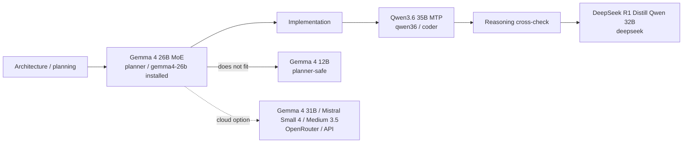

# ⚡ Local AI Coding Stack

<p align="center">
  
</p>

<p align="center">
  <strong>Local-first coding, reasoning, and planning on a 12 GB NVIDIA GPU.</strong><br>
  llama.cpp CUDA · Aider · Codex · OpenRouter · OpenCode
</p>

**Version:** `0.2.0` (`20260705`)

Private documentation and helper scripts for a local AI coding workflow on CachyOS Linux. The stack uses llama.cpp with CUDA for local GGUF models, Aider for local and OpenRouter-assisted coding, Codex for repo work, and OpenCode as an optional OpenRouter-only coding agent.

## 🧭 Stack At A Glance

| Layer | Choice | Role |
| --- | --- | --- |
| 🏗️ Planner | Gemma 4 26B A4B MoE, with Gemma 4 12B as safety fallback | Architecture, decomposition, risks, tests |
| 🛠️ Implementer | Qwen3.6-35B-A3B-MTP | Daily coding and repo work |
| 🧠 Reasoning fallback | DeepSeek-R1-Distill-Qwen-32B | Debugging and hard reasoning checks |
| ☁️ Cloud helper | Gemma 4 31B through OpenRouter by default | Non-local planner/coding option |

## 🖥️ Hardware

- OS: CachyOS Linux
- Shell: fish
- GPU: RTX 4070 Super-class NVIDIA GPU
- VRAM: 12 GB
- RAM: about 32 GB
- Local endpoint: `http://127.0.0.1:8080/v1`
- llama.cpp source: `~/ai/llama.cpp`
- llama.cpp server: `~/ai/llama.cpp/build/bin/llama-server`
- llama.cpp CLI: `~/ai/llama.cpp/build/bin/llama-cli`

## 🧩 Local Models

- Primary coding model: `~/ai/models/qwen3.6-35b-a3b-mtp/Qwen3.6-35B-A3B-MTP-UD-Q2_K_XL.gguf`
- Reasoning fallback: `~/ai/models/deepseek-r1-qwen-32b/DeepSeek-R1-Distill-Qwen-32B-Q2_K.gguf`
- Installed planner/architect model: `~/ai/models/gemma4-26b-moe/gemma-4-26B-A4B-it-Q4_K_M.gguf`
- Safer planner fallback: `~/ai/models/gemma4-12b/gemma-4-12B-it-Q4_K_M.gguf`

The `qwen36` profile uses the Qwen3.6-35B-A3B MTP quant with speculative draft-MTP settings, 128K context, q8_0 KV cache, and llama.cpp fit targeting for the 12 GB GPU. The Qwen3.6 profile set is intentionally limited to two options: `coder`/`qwen36` for default 128K work and `fast`/`qwen36-fast` for quick 32K work.



## 🚀 Optimized Profiles

| Profile | Model | Context | KV cache | Batch | uBatch | Role |
| --- | --- | ---: | --- | ---: | ---: | --- |
| `coder`, `qwen36` | Qwen3.6-35B-A3B-MTP | 131072 | q8_0 | auto-fit | auto-fit | Default daily coding |
| `fast`, `coder-fast`, `qwen36-fast` | Qwen3.6-35B-A3B-MTP | 32768 | q8_0 | auto-fit | auto-fit | Quick Qwen3.6 work |
| `deepseek` | DeepSeek-R1-Distill-Qwen-32B | 8192 | q4_0 | 256 | 64 | Reasoning/debugging fallback |
| `planner`, `gemma4`, `gemma4-26b` | Gemma 4 26B MoE Instruct | 8192 | q4_0 | 256 | 64 | Preferred planner/architect test |
| `planner-safe`, `gemma4-12b` | Gemma 4 12B Instruct | 8192 | q4_0 | 256 | 64 | Safer planner fallback if 26B MoE does not fit |

## 🏗️ Planner Model Shortlist

Researched on 2026-07-05. The third local slot should not be another implementation-first coder. It should review plans, architecture, risk, decomposition, and edge cases before Qwen3.6 or DeepSeek implement.

Gemma 4 is not only 12B. The family includes edge effective-size models, Gemma 4 12B, Gemma 4 26B MoE, and Gemma 4 31B Dense. The 26B MoE is the right first stretch target because it is larger than 12B but activates far fewer parameters per token; memory still depends on the full quantized weight file, so it needs an actual GGUF fit test on this 12 GB GPU.

| Rank | Candidate | Why it fits | Caveat |
| ---: | --- | --- | --- |
| 1 | Gemma 4 26B MoE Instruct | April 2026 MoE model; stronger planner target than 12B, with roughly 3.8B active parameters per token per Google's description. | Official GGUF Q4_K_M is about 16.8 GB; benchmark locally at 8K context before relying on it. |
| 2 | Gemma 4 12B Instruct | June 2026 model; Google positions it for advanced reasoning, multi-step agentic workflows, and local laptop use. | Use if the 26B MoE quant is unstable or too tight on 12 GB VRAM. |
| 3 | Gemma 4 31B Dense | Highest-quality Gemma 4 dense open model. | Too large for local 12 GB except extreme quantization; treat as cloud/future-hardware option. |
| 4 | Mistral Small 4 | March 2026 open hybrid model unifying instruct, reasoning, and coding, with 256K context. Strong cloud planner/architect candidate. | 119B total parameters makes local 12 GB use unrealistic. |
| 5 | Mistral Medium 3.5 | April 2026 frontier-class open-weight model optimized for agentic and coding use cases. Best cloud architecture reviewer. | Too large/expensive for local fallback. |
| 6 | Phi-4-reasoning-plus | 14B MIT model explicitly trained for reasoning, logic, planning, algorithmic tasks, and code. | Older April 2025 model; keep as compatibility fallback, not bleeding edge. |

Decision: test `Gemma 4 26B MoE Instruct` first as `planner`/`gemma4-26b`; keep `Gemma 4 12B Instruct` as `planner-safe`.

Sources:

- Gemma 4 announcement: https://blog.google/innovation-and-ai/technology/developers-tools/gemma-4/
- Gemma 4 12B announcement: https://blog.google/innovation-and-ai/technology/developers-tools/introducing-gemma-4-12B/
- Mistral model overview: https://docs.mistral.ai/models/overview
- Mistral Small 4: https://docs.mistral.ai/models/model-cards/mistral-small-4-0-26-03
- Mistral Medium 3.5: https://docs.mistral.ai/models/model-cards/mistral-medium-3-5-26-04
- Phi-4-reasoning-plus: https://huggingface.co/microsoft/Phi-4-reasoning-plus

## 🛠️ Aider Local

`aider-local` points Aider at the local llama.cpp server:

```fish
set -x OPENAI_API_BASE "http://127.0.0.1:8080/v1"
set -x OPENAI_API_KEY "sk-local"
aider --model openai/local --no-show-model-warnings
```

`dev-ai` switches the local model profile, waits for the API, and launches Aider.

## ☁️ OpenCode Through OpenRouter

OpenCode is configured as a cloud-routed coding agent through OpenRouter only. The repo includes `scripts/opencode-openrouter` and `scripts/setup-opencode-openrouter`, but it does not store keys.

Set the key outside the repo in fish:

```fish
set -Ux OPENROUTER_API_KEY "paste_key_here"
```

Then run:

```fish
opencode-openrouter
```

Inside OpenCode:

```text
/connect
/models
```

## ⌨️ Daily Commands

```fish
cd /path/to/project
dev-ai coder file.py
dev-ai qwen36 file.py
dev-ai qwen36-fast file.py
dev-ai deepseek file.py
dev-ai planner file.py
dev-ai planner-safe file.py
aider-openrouter file.py
opencode-openrouter
dev-ai stop
dev-ai status
```

## 🧼 Cleanup And Decision Records

- [Model decision log](docs/09-DECISION-LOG.md)
- [Cleanup log for 2026-07-05](docs/10-CLEANUP-LOG-2026-07-05.md)
- [Planner model shortlist](docs/08-PLANNER-MODEL-SHORTLIST.md)
- [Hardware and model notes](docs/01-HARDWARE-AND-MODELS.md)

## 🛡️ Safety Notes

- Do not commit real API keys.
- Do not commit `.env`.
- Do not commit GGUF model files.
- Do not delete `~/ai/models`, `~/ai/llama.cpp`, or `~/ai/local-ai-stack`.
- Do not force `--n-gpu-layers 999`; it caused CUDA OOM before.
- Keep `local-llm.service` disabled at login so it does not automatically consume VRAM.
- Start planner models only when doing planning or architecture review: `dev-ai planner file.py` or `llm-switch planner`.
- Stop the local server after planning: `dev-ai stop` or `llm-stop`.

## 🚫 What Not To Commit

Excluded by `.gitignore`:

- `.env`, key, token, and secret files
- `*.gguf`
- `models/` and `ai/models/`
- virtualenvs, node modules, caches
- generated local reports and logs
- local OpenCode auth files such as `~/.local/share/opencode/auth.json`
- `~/.config`

## Restore Scripts Into `~/bin`

From this repo:

```fish
cd ~/ai/local-ai-stack
cp scripts/* ~/bin/
chmod +x ~/bin/llm-switch ~/bin/dev-ai ~/bin/aider-local ~/bin/aider-openrouter ~/bin/cleanup-local-ai ~/bin/check-local-ai-setup ~/bin/llm-logs ~/bin/llm-status ~/bin/llm-stop ~/bin/llm-test ~/bin/opencode-openrouter ~/bin/setup-opencode-openrouter
```

## Future ChatGPT/Codex Sessions

Upload or paste:

- `NEXT-CHAT-CONTEXT.md`
- `docs/05-NEXT-CHAT-CONTEXT.md`
- `README-local-ai-coding-stack.md`
- optionally `~/local-ai-setup-report.txt`

These files contain the machine context, model paths, safe defaults, commands, and remaining optional work.
