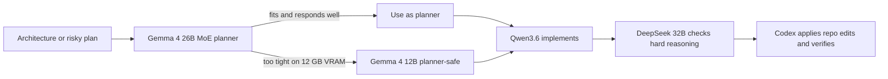

# 🧭 Decision Log

Updated: 2026-07-05

This file records the questions that shaped the stack. It is intentionally written as a decision trail, not just a final list of commands.

## ✅ Final Local Stack

| Slot | Model | Why it is here | Status |
| --- | --- | --- | --- |
| 🛠️ Primary implementer | Qwen3.6-35B-A3B-MTP | Best current local coding fit found for this 12 GB VRAM machine, with MTP speculative decoding and long-context settings. | Installed |
| 🧠 Reasoning fallback | DeepSeek-R1-Distill-Qwen-32B | Upgraded from the earlier smaller DeepSeek/Qwen direction so hard reasoning gets a larger model. | Installed |
| 🏗️ Planner / architect | Gemma 4 26B A4B MoE Instruct | Non-Qwen, non-DeepSeek planner slot for architecture, decomposition, risk review, and test strategy. | Installed, benchmark pending |
| 🧯 Safe planner fallback | Gemma 4 12B Instruct | Smaller Gemma 4 path if 26B MoE is too tight on 12 GB VRAM. | Installed, benchmark pending |

## 💬 Questions Asked And Decisions Made

| Question | Decision | Reasoning |
| --- | --- | --- |
| Why use Qwen3 when Qwen3.6 exists? | Use Qwen3.6, not old Qwen3/Qwen14. | The user wanted bleeding-edge models where practical. The old Qwen 14B model no longer matched the desired stack and was removed locally. |
| Should Qwen3.6 have three optimized profiles? | Limit Qwen3.6 to two profiles. | Keep `qwen36` for full-context work and `qwen36-fast` for quick work. A third profile added confusion without a clear role. |
| Did DeepSeek change from 14B to 32B? | Yes, the fallback is now DeepSeek-R1-Distill-Qwen-32B. | The fallback role is hard reasoning/debugging, so the 32B quant is more appropriate than a smaller previous target. |
| Should the third model be Qwen or DeepSeek? | No. | The third slot should add diversity and should focus on planning/architecture, not just implementation. |
| Is Gemma 4 only a 12B instruction model? | No. | Gemma 4 includes 12B, 26B A4B MoE, and 31B dense options. The 26B MoE is the preferred local planner test. |
| Is Gemma 4 26B dense? | No, the selected 26B option is MoE. | It has about 25.2B total parameters and about 3.8B active parameters per token, but the full quantized weights still need local memory. |
| Why not Mistral as the local third fallback? | Keep Mistral as a cloud/future-hardware planner option. | Mistral Medium 3.5 and Small 4 are attractive for architecture, but they are not realistic local 12 GB VRAM targets. |
| What is the cloud OpenRouter helper default now? | `google/gemma-4-31b-it`, overrideable with `OPENROUTER_AIDER_MODEL`. | It keeps the cloud helper aligned with the non-Qwen planner direction while staying easy to change. |

## 🧪 Fit Strategy



## 🧹 Cleanup Decision

The local machine should contain only models that still map to an active profile or a planned benchmark. The removed model was:

```text
~/ai/models/qwen3-14b
```

Generated reports, manifests, logs, and caches were treated as rebuildable outputs and removed from the local workspace. Credentials and OAuth tokens were not removed.
