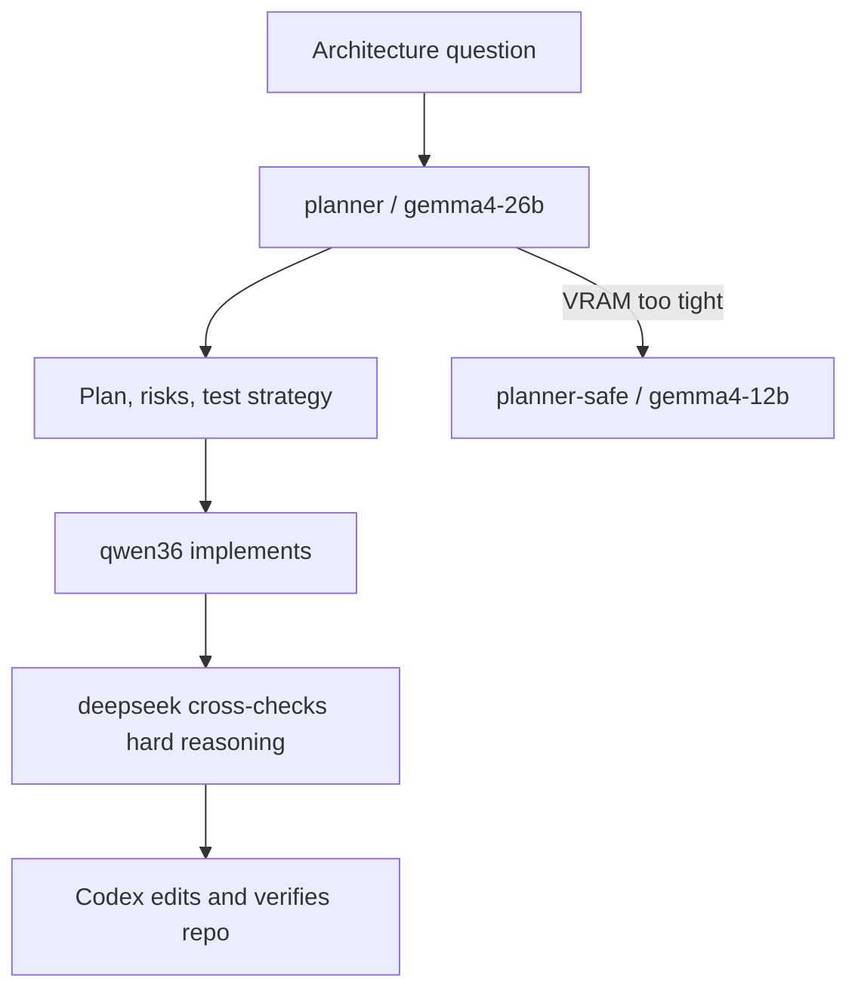

# Planner Model Shortlist

Updated: 2026-07-05

The third local model should be a planner/architect, not another implementation-first coder. Use it for architecture reviews, decomposition, risk analysis, edge cases, and test strategy. Qwen3.6 and DeepSeek remain the implementation and reasoning/debugging models.

Gemma 4 is not just a 12B instruction model. The current family includes edge effective-size models, Gemma 4 12B, Gemma 4 26B MoE, and Gemma 4 31B Dense. The 26B MoE is the preferred first test because it is larger than 12B without being fully dense at inference time. The 31B dense model is a cloud/future-hardware option.



## Ranked Candidates

| Rank | Model | Role | Notes |
| ---: | --- | --- | --- |
| 1 | Gemma 4 26B MoE Instruct | Preferred local planner target | April 2026 MoE model, built for advanced reasoning and agentic workflows. The official GGUF Q4_K_M file is about 16.8 GB, so benchmark it at 8K context before relying on it. |
| 2 | Gemma 4 12B Instruct | Safer local planner fallback | June 2026 dense/unified model, easier to fit locally than 26B MoE. |
| 3 | Gemma 4 31B Dense | Cloud or future-hardware planner | Best dense Gemma 4 quality target, but too large for this 12 GB GPU. |
| 4 | Mistral Small 4 | Cloud or future-hardware planner | March 2026 open model with instruct, reasoning, and coding in one model, 256K context, but 119B total parameters is not realistic on this GPU. |
| 5 | Mistral Medium 3.5 | Cloud architect | April 2026 frontier-class model optimized for agentic and coding use cases; use through API/OpenRouter, not local 12 GB. |
| 6 | Phi-4-reasoning-plus | Older local reasoning fallback | Strong explicit reasoning/planning model at 14B, MIT license, but April 2025 is not bleeding edge. |

## Current Decision

Try Gemma 4 26B MoE first as `planner` / `gemma4-26b`.

Installed path:

```text
~/ai/models/gemma4-26b-moe/gemma-4-26B-A4B-it-Q4_K_M.gguf
```

Fallback path:

```text
~/ai/models/gemma4-12b/gemma-4-12B-it-Q4_K_M.gguf
```

Start conservative:

```text
ctx 8192
KV cache q4_0
batch 256
ubatch 64
```

## Operating Flow

Use the planner only when it adds value:

```fish
dev-ai planner file.py
```

If the 26B MoE profile does not fit:

```fish
dev-ai planner-safe file.py
```

For a server-only start:

```fish
llm-switch planner
```

Stop the local model when planning is done:

```fish
dev-ai stop
```

or:

```fish
llm-stop
```

Sources:

- https://blog.google/innovation-and-ai/technology/developers-tools/gemma-4/
- https://blog.google/innovation-and-ai/technology/developers-tools/introducing-gemma-4-12B/
- https://docs.mistral.ai/models/overview
- https://docs.mistral.ai/models/model-cards/mistral-small-4-0-26-03
- https://docs.mistral.ai/models/model-cards/mistral-medium-3-5-26-04
- https://huggingface.co/microsoft/Phi-4-reasoning-plus
